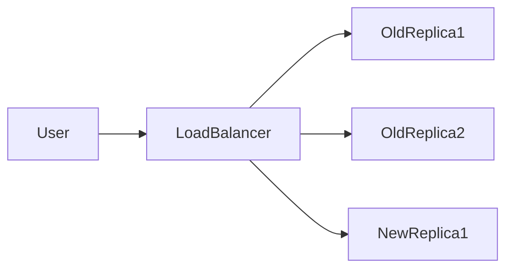

# Zero-Downtime Deployment with Docker and Docker Swarm

## Overview

**What it is** — Deploying new versions of your app without dropping user traffic or returning errors. Users keep getting responses while the new version rolls out.

**Why it matters** — Better availability, no dropped connections mid-request, better UX and SLAs. In production, avoiding a single point of failure and visible downtime is a core goal.

---

## Common strategies

- **Rolling update** — Replace instances one (or a few) at a time. Traffic stays on old tasks until new ones are healthy. No big-bang cutover.
- **Blue-green** — Two identical environments (blue = current, green = new). Deploy to green, test, then switch traffic in one cutover. You can emulate this with two services and a proxy (e.g. in Swarm or docker-compose).
- **Canary** — Route a small fraction of traffic to the new version, then increase gradually. Good for risk reduction; needs proxy or mesh support.

---

## Zero downtime with Docker (no Swarm)

Without an orchestrator, you achieve zero downtime by combining a **reverse proxy/load balancer** with **multiple app containers**.

1. **Reverse proxy or load balancer** — Put something like Nginx, Traefik, or Caddy in front of your app containers. It forwards requests to backend containers and can health-check them.
2. **Multiple containers (replicas)** — Run several app containers via docker-compose. The proxy spreads traffic across them.
3. **Deploy flow** — Start new containers with the updated image, wait for their health checks to pass, then stop the old containers (or adjust proxy upstream/weights). The proxy only sends traffic to healthy backends, so as long as at least one replica is up, there is no downtime.
4. **Compose tips** — Use `depends_on` with health checks so the proxy only targets healthy services. Define a `healthcheck` for your app service so the proxy (or your process) can decide when new replicas are ready.

---

## Zero downtime with Docker Swarm

Docker Swarm gives you **rolling updates** and **built-in load balancing** for services, so zero-downtime deploys are built in.

### Key commands

- Create a service with replicas:  
  `docker service create --replicas 3 --name myapp myimage:tag`
- Rolling update to a new image:  
  `docker service update --image myimage:newtag myapp`

### Update behavior

- **`--update-parallelism`** — How many tasks to update at once (default 1). Example: `--update-parallelism 2`.
- **`--update-delay`** — Delay between updating batches (e.g. `10s`). Gives new tasks time to become healthy before more old tasks are stopped.
- **`--update-failure-action`** — What to do if an update fails: `pause` (stop the rollout) or `rollback` (revert to previous spec).

New tasks join the mesh and receive traffic; old tasks are drained and stopped. As long as replicas are high enough and health checks pass, traffic is always served.

### Health checks

Use `--health-cmd`, `--health-interval`, `--health-timeout`, `--health-retries` (and related flags) on the service. Swarm only routes traffic to healthy tasks and does not consider a new task “ready” until it is healthy, so it won’t remove old tasks until replacements are ready.

### Why it works

- **Service VIP** — Clients talk to the service name; Swarm’s internal load balancer spreads traffic across healthy tasks.
- **Overlay network** — Tasks can run on any node; the mesh makes them reachable by service name.
- **Gradual replacement** — With parallelism and delay, you always have a set of tasks serving traffic while others are updated.

---

## Rolling update flow (concept)

During a rolling update: old replicas keep serving while new replicas are started and marked healthy; then old tasks are removed one (or a few) at a time. The load balancer always has healthy targets, so there is no downtime.
