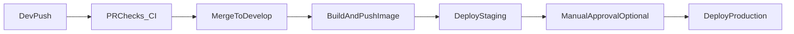

# Continuous Delivery and Continuous Deployment (Beginner Guide)

## What you will learn

- What **Continuous Delivery** means
- What **Continuous Deployment** means
- The difference between both
- How GitHub Actions helps automate the flow
- One beginner app example from code change to production

---

## Start with simple definitions

### 1) Continuous Integration (CI)
When developers push code, we automatically run checks:
- lint
- test
- build

Goal: catch bugs early.

### 2) Continuous Delivery (CDelivery)
After CI passes, your app is always in a releasable state.

In practice:
- build artifact/image is created
- artifact is pushed to registry
- app is deployed to staging
- production deploy is ready, but often needs **manual approval**

### 3) Continuous Deployment (CDeploy)
After CI passes, deployment to production happens **automatically** (no manual approval).

In practice:
- every successful change can go live automatically
- needs strong testing and monitoring

---

## Continuous Delivery vs Continuous Deployment

- **Continuous Delivery**: automatic pipeline, but production release is a business/manual decision.
- **Continuous Deployment**: automatic pipeline and automatic release to production.

Think like this:
- Delivery = "ready to release anytime"
- Deployment = "release happens automatically"

---

## Basic GitHub Actions flow

1. Developer pushes code or opens PR.
2. GitHub Actions runs CI (lint, test, build).
3. If CI passes:
   - build Docker image/artifact
   - push artifact to registry
4. Deploy to staging automatically.
5. For production:
   - **Continuous Delivery**: wait for manual approval, then deploy
   - **Continuous Deployment**: deploy automatically

---

## Example app: simple Notes API

Assume we have a Node.js Notes API:
- endpoint: `GET /health`
- Dockerized app
- image pushed to Docker Hub

We use 2 branches:
- `main`: production-ready code
- `develop`: integration/staging code

### Team flow

1. Dev creates feature branch: `feature/add-search`
2. Dev opens PR to `develop`
3. CI checks run on PR (lint/test/build)
4. Merge PR -> auto deploy to staging
5. After testing, merge `develop` to `main`
6. On `main`:
   - Delivery model: production job waits for approval
   - Deployment model: production job runs automatically

---

## Workflow architecture (concept)



---

## Beginner-friendly GitHub Actions example

This single workflow shows CI + staging + production gate behavior.

```yaml
name: CI-CD

on:
  pull_request:
    branches: [develop, main]
  push:
    branches: [develop, main]

jobs:
  ci:
    runs-on: ubuntu-latest
    steps:
      - name: Checkout
        uses: actions/checkout@v4

      - name: Setup Node
        uses: actions/setup-node@v4
        with:
          node-version: 20

      - name: Install
        run: npm ci

      - name: Lint
        run: npm run lint

      - name: Test
        run: npm test

      - name: Build
        run: npm run build

  build-and-push-image:
    if: github.event_name == 'push'
    needs: ci
    runs-on: ubuntu-latest
    steps:
      - name: Checkout
        uses: actions/checkout@v4

      - name: Login Docker Hub
        uses: docker/login-action@v3
        with:
          username: ${{ secrets.DOCKERHUB_USERNAME }}
          password: ${{ secrets.DOCKERHUB_TOKEN }}

      - name: Build and push
        uses: docker/build-push-action@v6
        with:
          context: .
          push: true
          tags: yourname/notes-api:${{ github.sha }}

  deploy-staging:
    if: github.ref == 'refs/heads/develop'
    needs: build-and-push-image
    runs-on: ubuntu-latest
    environment: staging
    steps:
      - name: Deploy to staging
        run: echo "Deploying image to staging server"

  deploy-production:
    if: github.ref == 'refs/heads/main'
    needs: build-and-push-image
    runs-on: ubuntu-latest
    environment: production
    steps:
      - name: Deploy to production
        run: echo "Deploying image to production server"
```

---

## How this becomes Delivery or Deployment

- If `production` environment in GitHub requires reviewers:
  - this acts as a manual gate
  - pipeline is **Continuous Delivery**

- If no manual gate is required and production job auto-runs:
  - pipeline is **Continuous Deployment**

---

## What to set up in GitHub (important)

1. Add repository secrets:
   - `DOCKERHUB_USERNAME`
   - `DOCKERHUB_TOKEN`
2. Create environments:
   - `staging`
   - `production`
3. (Optional but recommended) Protect `main` branch:
   - require pull requests
   - require CI checks to pass

---

## Real-world good practices

- Keep deployment scripts idempotent (safe to run multiple times).
- Add health checks after deploy (`/health`).
- Use rollback strategy (redeploy previous image tag).
- Tag images with semantic versions too (`v1.2.0`) not only commit SHA.
- Start with Continuous Delivery first; move to Continuous Deployment when tests/monitoring are mature.

---

## Quick recap

- CI validates code quality.
- Continuous Delivery prepares and ships safely with manual production control.
- Continuous Deployment ships automatically to production after successful checks.
- GitHub Actions connects all steps into one reproducible pipeline.
